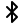
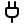
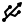
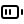
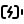
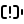
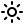
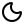
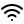

# Kirometer design standards

Kirometer is a small, friendly desk companion for Kiro. A quick glance should answer **how much credit have I used, is my device connected, and what is Kiro doing?** Keep the interface calm, readable, and recognizably related to Kiro.

This is the project standard for firmware, the Kiro Crew app, screen previews, and app-listing artwork. It records project choices; it is not an official Kiro brand guide. Last reviewed October 1, 2026.

## Source references

- [Kiro website](https://kiro.dev/): purple accent, neutral surfaces, typography and mascot identity.
- [Kiro Crew interface styles](https://github.com/kirodotdev/KiroCrew/blob/main/website/src/index.css): host theme tokens and the default Space Grotesk interface font.
- [Original Kiro directional sprites](https://github.com/kirodotdev/spirit-of-kiro/tree/main/client/src/assets/kiro-ghost): mascot poses.
- [Clawdmeter font guide](https://github.com/HermannBjorgvin/Clawdmeter/blob/main/docs/fonts.md): precompiled font workflow. Our firmware uses Arduino GFX, so its LVGL-specific conversion commands do not apply directly.

## Typography

| Surface / role | Font | Weight and scale |
| --- | --- | --- |
| Firmware supporting labels, reset date, connection | Space Grotesk Regular | 20 px |
| Firmware battery percentage and secondary metrics | Space Grotesk Regular | 24 px |
| Firmware plan name, primary metrics, long state labels | Space Grotesk Bold | 36 px |
| Firmware short state names and detail values | Space Grotesk Bold | 48 px |
| Firmware face hero metrics | Space Grotesk Bold | 64 / 80 / 120 px |
| Crew app body and controls | Inherit Crew's active font | 14–16 px; regular body, semibold controls |
| Crew app page title / section headings | Inherit Crew's active font | 28–32 / 18–20 px |
| Website-style marketing previews | AWS Diatype; rounded semi-mono headings where available | Use the existing website preview stylesheet |

**Firmware standard: Space Grotesk**, the default Kiro Crew interface font. The Kiro website uses AWS Diatype and AWS Diatype Rounded Semi-Mono, but its font metadata restricts modification and redistribution. Do not package those web fonts or derivative bitmaps in releases without separate permission. Space Grotesk is distributed under SIL OFL 1.1; retain its license with firmware packages.

- Bake each size from the source font, with **4-bit antialiasing**. Do not enlarge a smaller bitmap font to make a heading.
- Use the same glyph metrics for drawing, centering, right alignment, and fitting.
- Prioritize readable numbers. Reduce padding or remove secondary information before reducing the main metric size.
- Fit long values within their allocated region; never let them overlap percentages, labels, or screen edges.
- Use regular sentence case for labels. Preserve upstream plan names such as `KIRO PRO`.
- Preview thumbnails must use the same typography as firmware; label sample credit data as illustrative.
- Current firmware glyph coverage: printable ASCII and an ellipsis. Unsupported Unicode displays a replacement question mark, not broken UTF-8 bytes. Expand the atlas deliberately when adding localized UI.

Sources live in `firmware/assets/fonts/`; generated coverage atlases live in `firmware/src/fonts/space_grotesk.h`. Regenerate with `scripts/build_fonts.py` using Pillow 12.3.0. `firmware/src/smooth_text.h` blends the coverage into the existing RGB565 canvas, including tinted cards. Font rasterization is a build-time operation, never device work.

## Color

Use color to communicate meaning, not to decorate every surface. Purple is the brand accent; red is overage/error; green is connected/completed. Always pair status color with a word or icon.

| Token / purpose | Canonical web value | Device guidance |
| --- | --- | --- |
| Brand purple / selected controls / included usage | `#9147FF` | RGB565 `0x923F` |
| Light purple / state text / plan text | `#C49CFF` | Current device `0xC51F` |
| Screen background | **`#000000`** | `0x0000`; keep pure black |
| Primary screen text | `#FFFFFF` | `0xFFFF` |
| Secondary screen text | `#B0ADB6` | Current device `0xAD55` |
| Neutral screen card | `#101012` | Current device `0x1082` |
| Plan banner | `#211031` | Current device `0x2106` |
| Meter track | `#29292D` | Current device `0x2945` |
| Overage / error | `#FF607A` | Current device `0xFB2F` |
| Connected / complete | `#78ECB5` | Current device `0x6EF3` |

RGB565 is a limited palette; the current device values are deliberate approximations, not exact hex equivalents. Use these named roles consistently when making new layouts. Do not replace the AMOLED background with the website's tinted dark surface.

**Crew app:** use host tokens (`--background`, `--surface`, `--text`, `--muted`, `--border`, and the available theme equivalents), scoped to `.km`. Preserve the host light/dark mode and chosen font. Purple selected states need legible text in both modes; white-on-purple primary buttons are appropriate. Avoid broad global CSS overrides.

**Enclosure/artwork:** white body, purple accent `#9147FF`. Keep physical material appearance separate from UI color accuracy.

## Layout and spacing

### Device: 480 × 480 pixels, 2.16-inch AMOLED

- Main content edge inset: 18–30 px. Card interior inset: 16 px. Use 4 / 8 / 12 / 16 / 20 / 24 px spacing increments where practical.
- Use rounded rectangular cards and bars. A simulated enclosure is a thick white rounded-square frame with a flat top edge, not a ghost-shaped dome.
- Existing layouts put battery/USB/charging and Bluetooth indicators in the top-right. New concepts may relocate this chrome or remove a fixed top bar to improve their composition (user direction, October 1, 2026). Keep connection and power information discoverable. Show real reported states; never imply a battery or wireless link exists when it does not.
- Use concise `Connected` / `Disconnected` text with a colored dot. Companion places it top-left; Usage dashboard places it at the bottom.
- The main page shows the important information. Tapping the usage area opens large-text details; use at least a 42 px-high back target and generous hit areas.
- No redundant subtitle below the mascot. No decorative timestamps or invented timed quotas.
- Keep empty black space around animation regions. Prevent animated pixels from overlapping text or bars.

### Implemented layouts

| Layout ID | Name | Hierarchy |
| --- | --- | --- |
| `ghost` | Ghost companion | Connection/power → activity → large mascot → compact plan/credit usage |
| `usage` | Usage dashboard | Small mascot/power → full-width plan banner → included credit usage → red overage card → connection |

| `orbit` | Orbit | Included-credit percentage ring → ghost → used/allowance → red overage |
| `sidekick` | Sidekick | Large credits used beside mascot → allowance bar → overage/reset |
| `ticket` | Credit ticket | Plan ticket → large used count → dashed divider → overage/reset |
| `big_number` | The big number | Large credits remaining or overage → allowance bar → reset/mascot |

All six faces are equal peers. Swipe left or right from any awake face or its detail view to cycle, wrapping at either end. The Crew app sets the startup default and applies it immediately. Manual swipes change only the current face, leaving that default unchanged. The first touch during sleep only wakes the screen. A short face-name and six-dot indicator confirms a switch; do not slide an entire framebuffer.

For Usage dashboard, keep the plan card at `(20, 80, 440, 42)`, credit card at `(20, 136, 440, 152)`, and overage card at `(20, 302, 440, 132)` unless changing the complete layout deliberately. Reset date belongs inside the credit card. Percentage and the used/allowance value must not collide.

### Crew app

- Separate **set up a new device**, **connect an existing device**, and **manage a connected device**.
- Device tabs: Default screen, Customize, Connection, Firmware. Keep face selection in Default screen; naming, brightness, and sleep controls stay in Customize. Reuse the Crew listing enclosure icon on device cards, with inherited theme colors.
- Show the currently connected device and its actual firmware/control capability before customization.
- Card content needs padding on all four sides, including empty/error states. Use 24 px on desktop, 16 px on narrow layouts.
- Keep controls and explanatory text grouped with the setting they affect. Avoid large blank gaps between a heading and its controls.
- Use a responsive gallery of square device previews, a clear title, a short description, and a native radio choice.
- Distinguish `Available`, `Selected · save to apply`, and `On your device`. A local selection is not device confirmation.
- Allow browsing all six faces before connecting a device. Only enable setting a default when the connected firmware supports that face. Keep a bounded firmware-update console/history accessible without a device.
- Disable unsupported layouts with a firmware-update explanation. Do not list a concept as an available working layout.
- All choices remain keyboard accessible, have visible focus, and work without interpreting color alone.

## Credit semantics

- Say **credits**, not tokens, for Kiro plan consumption.
- Show `used / allowance`, percentage, and the actual monthly reset date. No five-hour or weekly countdowns.
- Cap a filled plan bar at 100%, but allow its numeric percentage to exceed 100%.
- Overage is additional consumption beyond the included allowance. Keep it visible and red when nonzero.
- Until a real overage budget is supplied, the overage bar compares overage with the **plan allowance** and says so explicitly. Never imply that this reference is an overage cap.
- Zero usage is different from unavailable data. Show `Unavailable`, `--`, or a clear stale state rather than a fabricated zero.
- Do not invent prices, reset dates, account identities, plan limits, or battery percentages.

## Mascot and motion

Use the actual Kiro mascot assets. Preserve the silhouette and eyes; do not redraw an approximate cartoon. Asset provenance and notices are in `firmware/GHOST-SOURCE.md` and `firmware/GHOST-LICENSE`.

- Directional North/East/South/West poses provide state variation. Ready floats gently and occasionally blinks; Working uses more purposeful turns; attention, success, and error have distinct bounded gestures.
- Idle still has subtle life. Blinking is brief and occasional, not a regular strobe.
- Animations remain inside reserved black rectangles. No floating overlay ghost crossing bars, no colored repaint trails.
- Current animation scheduler target: 50 ms (20 ticks/s). This is not a claim about the panel's physical refresh rate. Measure transfer duration and dropped/late frames when adding animation.
- Use partial transfers for animation. Update static metrics only when their content changes.
- Screensaver is mostly black with intermittent peeks. Rotate the ghost so its head and eyes enter first from each edge. Touch wakes it.
- Web previews honor reduced motion. Do not make a website animation look smoother or more elaborate than the hardware can support without labeling it a concept.

## Icons and listing artwork

### Interface icons: Lucide by default

Use **Lucide** for all functional interface icons. This matches Kiro Crew's
[`lucide-react` dependency](https://github.com/kirodotdev/KiroCrew/blob/main/website/package.json)
and its [sidebar imports](https://github.com/kirodotdev/KiroCrew/blob/main/website/src/pages/ChatSidebar.tsx),
verified October 1, 2026. Material icons were an example, not a requested second
library; do not mix icon families by default.

| Meaning | Lucide icon | Sample |
| --- | --- | --- |
| Bluetooth connected | `bluetooth` |  |
| USB-only power / plugged in | `plug` |  |
| USB data connection | `usb` |  |
| Battery level | `battery`, `battery-low`, `battery-medium`, `battery-full` |  |
| Battery charging | `battery-charging` |  |
| Battery reading unavailable | `battery-warning` with explicit unknown text |  |
| Brightness | `sun` |  |
| Display sleep | `moon` |  |
| Wi-Fi (only if actually supported/connected) | `wifi` |  |

- Preserve the original **24 × 24 viewBox, 2-unit stroke, rounded caps and joins**. Do not sketch approximations or use Unicode/emoji substitutes.
- Typical app size: 20 px inline, 24 px in controls. Device concept size: 24–32 px. Scale uniformly; never stretch to fit a rectangle.
- Use `currentColor` in the app so icons follow host light/dark tokens. Use white or muted gray against the device's pure black background. Purple indicates selection; red/green keep their existing meanings.
- Keep the percentage beside the battery. The fill glyph is approximate: full ≥95%, medium ≥40%, low ≥10%, empty <10%. Charging has its own icon; USB with no battery has a plug. Unknown is never shown as an empty or full battery.
- Decorative icons beside labels are hidden from assistive technology. An icon-only control must have a meaningful accessible name and a generous hit target.
- The Kiro mascot and custom duotone Kirometer app logo are brand artwork, not replacements for this functional icon family.
- Shared assets: `crew-app/ui/art/icons/`; generated module: `crew-app/ui/icons.mjs`; generator: `scripts/build_icons.py`. Retain the included ISC license in packages. Previews and app controls now consume these assets. Firmware 0.6.0 uses these same paths baked at 24/32 px with 4-bit antialiasing. Regenerate with `scripts/build_device_icons.py` (CairoSVG and Pillow).

### Brand artwork

- App icon: front-view ghost enclosure outline with a rounded-square screen cutout. Use a consistent, substantial stroke, rounded joins, neutral gray structure, and purple accents.
- Duotone means gray plus purple in distinct meaningful parts, like Crew's existing app icons. It does not mean two nearly identical purples or a shaded multicolor illustration.
- Keep the small sidebar icon legible at native size. Avoid extra detail or hairlines.
- Banner mascot must use the actual Kiro asset. Preserve image aspect ratios; no stretched thumbnails.
- Screenshots show current UI. Illustrative mockups and sample metrics must be identifiable as such.

## Adding a gallery layout

1. Define a stable ID, primary purpose, hierarchy, and actual supported metrics.
2. Implement its firmware renderer and bounded animation/touch regions.
3. Add control validation, startup-default persistence, current-face status, swipe-cycle membership, and capability handling.
4. Render firmware thumbnails with `scripts/render_face_previews.py`, then add the layout to `scripts/build_layout_previews.py`; regenerate `ui/layouts.mjs` and thumbnails using the shipped font assets.
5. Verify labels at zero, typical, exceeded, stale, unavailable, and large values; check card and indicator collisions.
6. Test selection, save, device acknowledgement, reconnect, and restart persistence. Check the gallery in light and dark modes.
7. Build the firmware bundle with notices, update the changelog, and package only supported layouts.

Keep this document updated when an accepted design decision changes. A passing build proves compilation; browser checks prove app behavior; a successful flash proves delivery; physical viewing proves device appearance. Report those separately.
