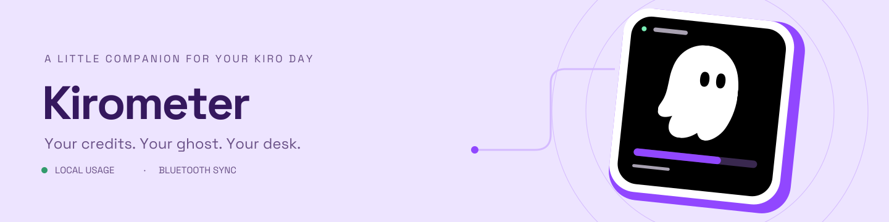

# Kirometer

A Kiro Crew app and ESP32-S3 desk companion with credit usage, activity-aware ghost animations, and Bluetooth device controls.

**Install from Crew:** add `https://github.com/erikankrom/kirometer.git` as an external app registry, choose branch **`crew-release`**, then install and enable **Kirometer**. This private repository requires GitHub read access. See [remote installation and releases](docs/remote-releases.md).

App **0.7.0** · firmware **0.5.8** · macOS device management · Waveshare ESP32-S3-Touch-AMOLED-2.16.

A desktop Kiro utilization display inspired by [CodexMeter](https://github.com/tomatoeggs/CodexMeter) and its [printed enclosure](https://makerworld.com/en/models/3046835-codexmeter-codex-remaining-usage-running-status-in).

## Design direction

Use the mascot from the installed Kiro app icon: white rounded asymmetric ghost, two black oval eyes, purple background. `kiro-icon-reference.png` is extracted from the installed app as a design reference; it is not an original Kirometer asset or a grant of redistribution rights. The enclosure and screen should preserve that silhouette rather than use a generic ghost.

## Crew data collector

The preferred collector is the Kiro Crew app in `crew-app/`. Crew manages background collection and hosts its status page. See [Crew app setup](docs/crew-app.md). The package is installed and enabled locally. Crew session activity is integrated; Bluetooth sync automatically reconnects after temporary interruptions. USB-C handles firmware installation.

The v0.7.0 Crew app includes macOS USB flashing, Bluetooth LE discovery and usage sync, persistent naming, brightness and a touch-wake peeking-ghost screensaver. See [device management](docs/device-management.md). Bluetooth usage, brightness, sleep/wake and renaming were verified on the physical board with 0.5.0; 0.5.3 is flashed and connected over encrypted BLE, and the user confirmed touch-to-wake. Crew session activity detection is implemented; billing freshness follows the existing cache.

## Local usage diagnostic

Run `python3 kirometer.py` on macOS or `py -3 kirometer.py` on Windows. No dependencies, credentials, API requests, or changes to Kiro configuration are required. Windows profile detection is implemented but still needs validation with a real Windows Kiro installation.

The reader opens Kiro's `User/globalStorage/state.vscdb` in read-only mode and selects only `kiro.kiroAgent` → `kiro.resourceNotifications.usageState`. It emits normalized credit usage and cache freshness. `--db PATH` selects another database; `--stale-after SECONDS` changes the default five-minute freshness threshold.

Verified on this machine September 30, 2026: the cache exposes `currentUsage`, `usageLimit`, `resetDate`, and a millisecond `timestamp`. The observed snapshot dates to September 8 and must be shown as stale, not live utilization. These internal fields may change between app versions. Plan remaining credits exclude unvalidated add-on packs. Missing data is unknown, never a fabricated zero or full balance.

The standalone diagnostic keeps activity unknown; the Crew app obtains activity from Crew sessions. A cached credit balance alone does not establish that the agent is working or idle. No prompts, source code, or account tokens are included in the output.

Run `python3 -m unittest -v` to check freshness, missing/zero limits, and database read-only behavior.

## Remaining work

- Validate local task/activity telemetry and cache updates while Kiro is running.
- Physically test the generated mascot enclosure and fit coupon.
- Adapt BLE transport and firmware for the selected hardware (the reference uses Waveshare ESP32-S3-Touch-AMOLED-2.16).
- Validate hardware behavior, including disconnect and stale-data displays.

This is a usage-reader prototype, not installed firmware or a running background service.

## macOS and Windows firmware utilities

Run `./scripts/deploy-macos.sh setup` on macOS or `.\scripts\deploy-windows.ps1 setup` in Windows PowerShell to create a project-local Python environment and run tests. Use the same wrapper with `run` for a usage snapshot. See [software deployment](docs/software-deployment.md) for profile paths, Windows policy-safe alternatives, and explicit PlatformIO tool installation, serial device listing, build and flash commands.

Firmware commands require a separately supplied compatible PlatformIO project. Kirometer firmware and USB transport are included in `firmware/` and `crew-app/`; the legacy wrappers remain available for explicit PlatformIO builds. Flashing requires an explicit `flash` command, environment and serial port; ordinary setup and usage reads do not touch hardware.

## Enclosure and animated concept

STL files are in `exports/`: `kirometer-ghost-body.stl`, `kirometer-rear-cover.stl`, and `kirometer-fit-coupon.stl`. They target the complete factory Waveshare housing. See [printing and fit](docs/printing-and-fit.md) for dimensions, assembly, validation, and test-print limitations.

Current version: compact PLA friction-fit v6, approximately 66 × 80 × 36 mm body envelope. Four vertical tapered pegs on the cover press straight into sockets in the body. The connectors require no retaining lips, slide movement, bending clips, or separate lock key. Pegs and sockets build vertically with supports disabled. All parts can be PLA. The coupon includes three trial socket diameters; test the cover pegs before printing the full shell. Includes top-button plungers, 15° self-standing tilt, rear cord routing, and an unchanged screen opening. Physical fit and retention remain untested.

Open [the interactive screen showcase](previews/screen-showcase.html) for six activity states (Idle, Working, Needs attention, Complete, Error, Unknown) and independent usage freshness and telemetry-link controls, mascot animations, simulated plan and overage metrics, brightness controls, and an implementation feature map. The original compact concept is in `previews/screen-concept.html`. The showcase theme uses Kiro website color tokens and AWS Diatype font families (`previews/assets/kiro-theme.css`). Fonts load from kiro.dev with offline system fallbacks. The simulated screen includes a connection indicator, red overage, and a scrollable usage-details drawer opened with the bottom handle or an upward swipe. The showcase uses five directional ghost PNGs from [Spirit of Kiro](https://github.com/kirodotdev/spirit-of-kiro/tree/main/client/src/assets/kiro-ghost), with runtime eye overlays for blinking. Original artwork, source revision, and its license are bundled in `previews/assets/kiro-ghost/`. It uses demo data; it is not firmware. Renders are in `previews/`, and editable CAD is in `cad/kirometer-enclosure.blend`.

The P1S / 0.4 mm project is `exports/kirometer-bambu.3mf`, with three plates: white fit coupon first, white body, and purple cover/buttons. White and purple PLA assignments are saved in the project. A potential MakerWorld listing is drafted in [makerworld-draft.md](docs/makerworld-draft.md); it has not been published.

## Remote app releases

[Release packaging and Crew registry setup](docs/remote-releases.md) describes the GitHub release workflow and the `crew-release` distribution branch. [Firmware ghost animation preview](previews/ghost-activity.html) uses the actual directional sprite frames and motion samples.
